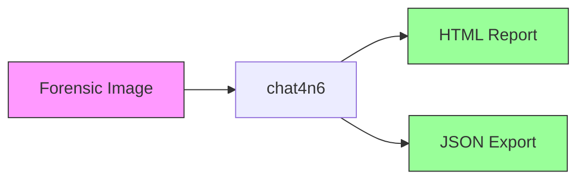
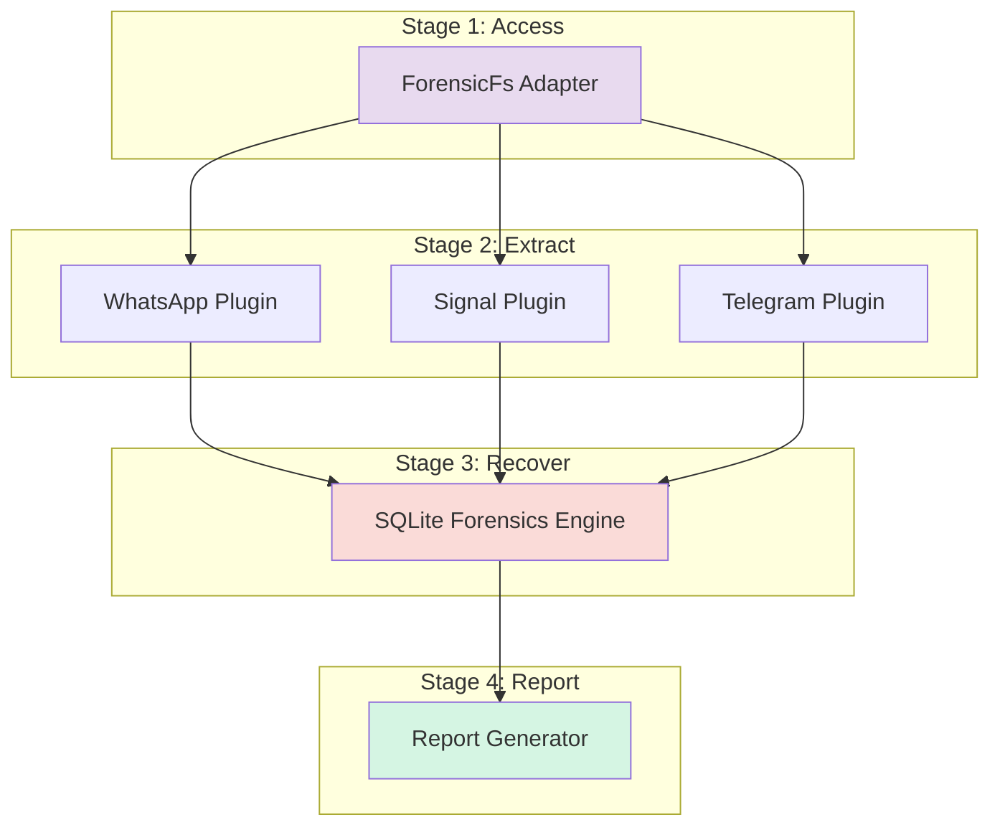
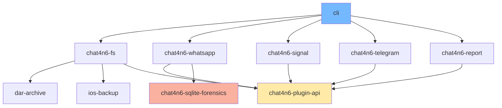
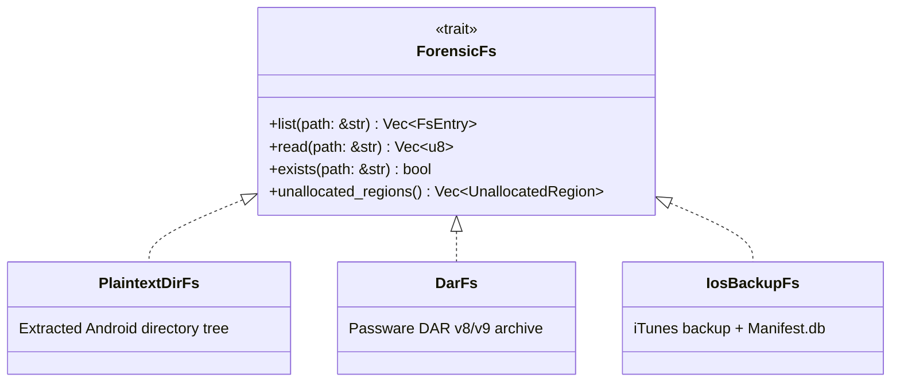
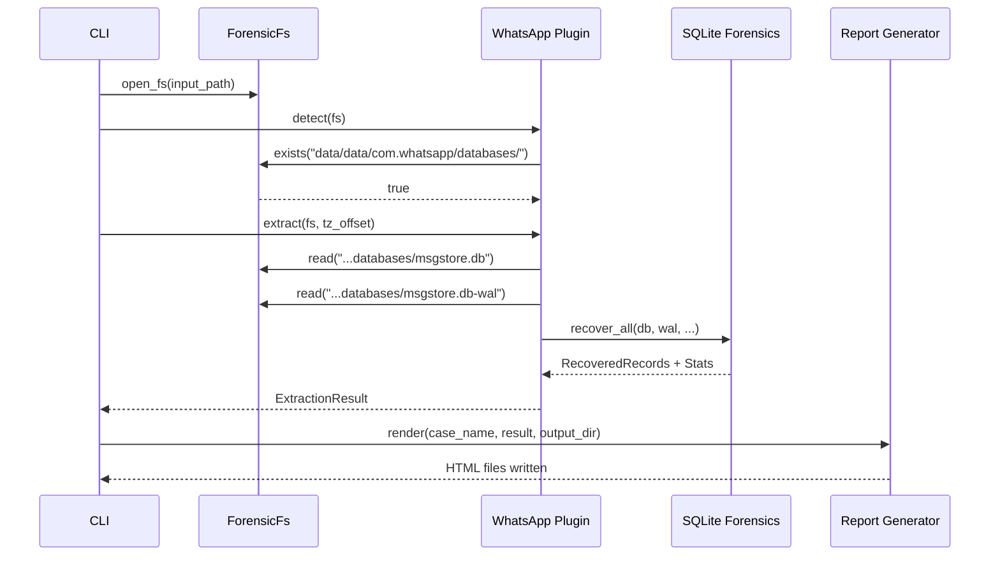
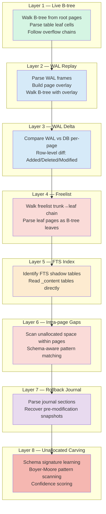
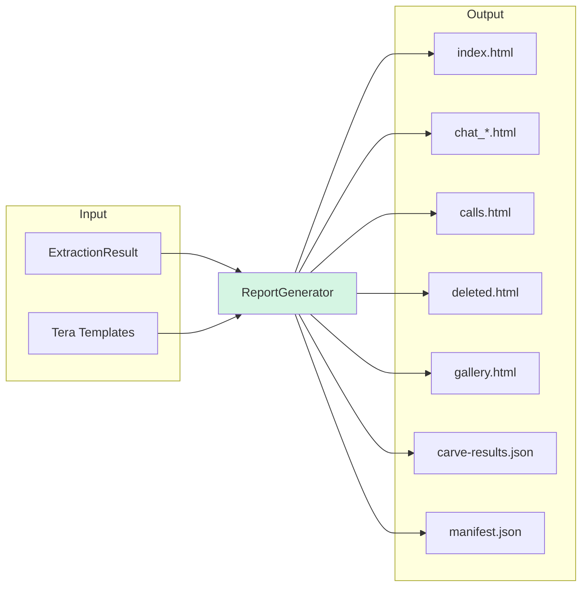
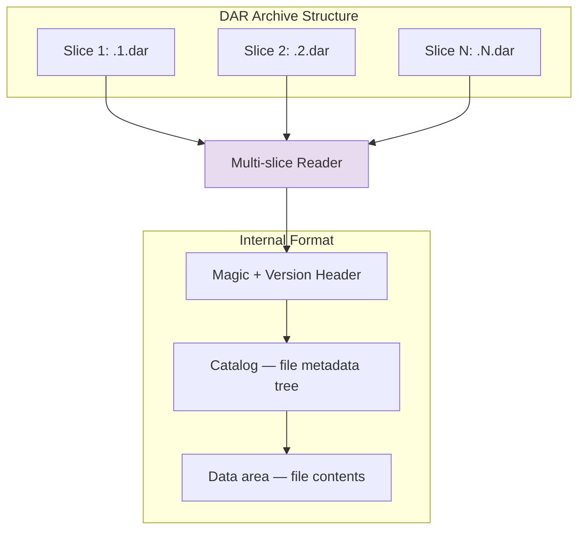

# Architecture

This document describes chat4n6's architecture in progressive layers of detail. Start at the top for a high-level understanding; go deeper as needed.

---

## Level 1: What It Does

chat4n6 takes a forensic image (Android filesystem, DAR archive, or iOS backup), runs every messaging plugin against it, recovers live and deleted artifacts through an eight-layer SQLite forensics engine, and produces a self-contained HTML report.



One command does everything:

```bash
chat4n6 run --input ./image --output ./report
```

---

## Level 2: Pipeline Overview

The pipeline has four stages. Each stage has a single responsibility and communicates through well-defined types.



| Stage | Crate | Purpose |
|-------|-------|---------|
| Access | `chat4n6-fs` | Uniform filesystem interface over DAR/iOS/plaintext |
| Extract | `plugins/*` | App-specific database parsing (WhatsApp, Signal, Telegram) |
| Recover | `chat4n6-sqlite-forensics` | Eight-layer deleted data recovery with confidence scoring |
| Report | `chat4n6-report` | Tera-templated HTML + JSON report generation |

---

## Level 3: Crate Map

The workspace contains 10 crates. Dependencies flow downward — no cycles.



### Crate Responsibilities

| Crate | Lines | Role |
|-------|-------|------|
| **chat4n6-plugin-api** | ~230 | Core trait definitions (`ForensicFs`, `ForensicPlugin`) and shared types (`Message`, `EvidenceSource`, `ForensicTimestamp`) |
| **chat4n6-fs** | ~500 | Three filesystem adapters behind a uniform `ForensicFs` trait |
| **dar-archive** | ~800 | Passware DAR v8/v9 archive parser with infinint decoding and catalog traversal |
| **ios-backup** | ~300 | iTunes Manifest.db reader with file_id-based path virtualization |
| **chat4n6-sqlite-forensics** | ~5300 | Eight-layer SQLite recovery engine (22 modules, 573 tests) |
| **chat4n6-whatsapp** | ~1500 | WhatsApp database parsing: messages, calls, contacts, media, reactions, crypt14/15 decryption |
| **chat4n6-signal** | ~50 | Signal plugin (placeholder — scaffolded, not yet implemented) |
| **chat4n6-telegram** | ~50 | Telegram plugin (placeholder — scaffolded, not yet implemented) |
| **chat4n6-report** | ~600 | Tera-based HTML report generator with pagination, gallery, and JSON export |
| **cli** | ~150 | Clap-based CLI with auto-detection, progress bar, timezone resolution |

---

## Level 4: Filesystem Abstraction

Plugins never touch raw files. They interact with a `ForensicFs` trait that abstracts over three acquisition formats.



**Auto-detection logic** (in `cli/src/commands/run.rs`):

1. Input is a file with `.dar` extension → `DarFs`
2. Input is a directory containing `Manifest.db` → `IosBackupFs`
3. Input is a directory → `PlaintextDirFs`

The `DarFs` adapter deserves special mention: DAR archives use a custom binary format with infinint-encoded lengths, multi-slice storage, and an internal catalog. The `dar-archive` crate parses this format without external tools or the `libdar` C library.

---

## Level 5: Plugin System

Each messaging app is a plugin implementing `ForensicPlugin`:

```rust
pub trait ForensicPlugin: Send + Sync {
    fn name(&self) -> &str;
    fn detect(&self, fs: &dyn ForensicFs) -> bool;
    fn extract(&self, fs: &dyn ForensicFs, tz_offset: Option<i32>) -> Result<ExtractionResult>;
}
```

The CLI iterates all registered plugins, calls `detect()` to check if the app's databases exist on the image, then calls `extract()` for each detected app. Results are merged into a single `ExtractionResult`.



### WhatsApp Plugin Internals

The WhatsApp plugin (`chat4n6-whatsapp`) handles:

- **Database locations**: `msgstore.db` (messages), `wa.db` (contacts), `axolotl.db` (Signal protocol keys)
- **Schema evolution**: Handles WhatsApp schema versions across Android releases
- **Encryption**: Decrypts `.crypt14` / `.crypt15` backup databases when a key file is provided
- **Timezone resolution**: Accepts IANA names (`Asia/Manila`) or UTC offsets (`+08:00`)
- **Artifact types**: Messages (text, media, location, vcard, system), calls, contacts, reactions, quoted messages

---

## Level 6: SQLite Forensics Engine

The core of chat4n6. This crate operates on raw SQLite bytes — no `sqlite3` library, no SQL queries. It parses the binary format directly, which allows recovery from areas that the SQLite library considers invalid or inaccessible.

### Recovery Layers



### Module Map

The 22 source modules in `chat4n6-sqlite-forensics`:

```
src/
├── header.rs          # SQLite header parsing (page size, freelist pointer, encoding)
├── page.rs            # Page type detection (TableLeaf, TableInterior, IndexLeaf, IndexInterior)
├── varint.rs          # SQLite varint encoding/decoding (1-9 byte variable-length integers)
├── record.rs          # Record format parsing: serial types → SqlValue decode
├── btree.rs           # B-tree traversal: walk, parse leaf cells, follow overflow chains
│
├── pragma.rs          # Forensic PRAGMA fingerprinting from raw header bytes
├── context.rs         # RecoveryContext: shared immutable state for all layers
├── db.rs              # Orchestrator: recover_all(), build_context(), layer dispatch
│
├── wal.rs             # WAL header/frame parsing, Layer 2 replay, Layer 3 delta analysis
├── wal_enhanced.rs    # WAL frame classification (committed/uncommitted/superseded)
├── freelist.rs        # Freelist trunk→leaf chain traversal, Layer 4 recovery
├── fts.rs             # FTS3/4/5 shadow table detection, Layer 5 content recovery
├── gap.rs             # Intra-page unallocated space scanning, Layer 6
├── journal.rs         # Rollback journal parsing, Layer 7 recovery
├── unalloc.rs         # Unallocated space carving with schema signatures, Layer 8
├── carver.rs          # Low-level record carving: Normal, ColumnsOnly, FirstColMissing modes
│
├── schema_sig.rs      # Schema signature learning: column types → Boyer-Moore patterns
├── dedup.rs           # SHA-256 record deduplication across all layers
├── page_map.rs        # Page-to-table ownership mapping (bring2lite Algorithm 2)
├── freeblock.rs       # Intra-page freeblock recovery (bring2lite Algorithm 3)
├── rowid_gap.rs       # ROWID gap detection for deletion evidence
└── verify.rs          # Verification report: SHA-256 hashes + shell commands for testimony
```

### RecoveryContext

All recovery layers share an immutable `RecoveryContext` to avoid re-parsing shared state:

```rust
pub struct RecoveryContext<'a> {
    pub db: &'a [u8],                           // Raw database bytes
    pub page_size: u32,                          // From header (512..65536)
    pub header: &'a DbHeader,                    // Parsed SQLite header
    pub table_roots: HashMap<String, u32>,       // table_name → root page
    pub schema_signatures: Vec<SchemaSignature>,  // For carving
    pub pragma_info: PragmaInfo,                  // auto_vacuum, journal_mode, etc.
}
```

### Pragma-Aware Layer Skipping

The engine reads forensic PRAGMA values from raw header bytes (not via SQL — the database may be corrupt). These inform which layers are viable:

| PRAGMA | Stored at | Effect |
|--------|-----------|--------|
| `auto_vacuum = FULL` | Header bytes 52+64 | Skip freelist recovery (no freelist exists) |
| `secure_delete = ON` | Runtime only | Skip gap/freeblock scanning (zeroed on delete) |
| `journal_mode` | Header bytes 18-19 | Determines WAL vs. rollback journal availability |

### Confidence Scoring

Carved records (Layers 6 and 8) include a confidence percentage. The scoring works by:

1. **Learning phase**: Analyze all live records (Layer 1) to build `SchemaSignature` patterns — the column count and serial type distribution for each table
2. **Scanning phase**: When a candidate record is found in unallocated space, compare its serial type sequence against learned signatures
3. **Scoring**: The confidence percentage reflects what fraction of live records share the same serial type pattern

A carved record at 94% means its column types match 94% of live records in that table. Below 80%, false positive rates increase significantly.

### Deduplication

Records can appear in multiple layers (e.g., a live record also exists in a WAL frame). The engine uses SHA-256 hashing across `(table, row_id, values)` tuples to deduplicate, preserving the highest-provenance source for each unique record.

---

## Level 7: Report Generation

`chat4n6-report` uses Tera templates (embedded via `rust-embed`) to produce static HTML:



Key design decisions:
- **No JavaScript** — reports work offline, in restricted environments, and pass security review for legal submission
- **Pagination** — conversations are split at 500 messages per page to keep file sizes manageable
- **Dual timestamps** — every timestamp shows both UTC and local time with offset
- **Evidence tags** — every record displays its source tag inline

---

## Level 8: DAR Archive Format

The `dar-archive` crate parses Passware DAR (Disk ARchive) format, which is the output of Passware Kit Mobile and some other acquisition tools.



Features:
- **Multi-slice support**: Archives split across files (`.1.dar`, `.2.dar`, etc.) are reassembled transparently
- **Infinint decoding**: DAR uses a custom variable-length integer encoding for sizes and offsets
- **Catalog traversal**: File metadata (paths, sizes, permissions) stored in a tree structure
- **Streaming reads**: File contents are read on demand, not loaded into memory

---

## Design Principles

1. **No C dependencies.** The entire SQLite format is parsed in pure Rust. This eliminates build complexity, ensures cross-platform reproducibility, and — critically — allows reading data that `libsqlite3` would refuse to touch.

2. **Provenance over quantity.** Every record carries its evidence source. A tool that recovers 1,000 records without attribution is less useful than one that recovers 800 with clear provenance. In forensics, knowing *where* evidence came from matters as much as having it.

3. **Confidence over certainty.** Carved records are probabilistic. Rather than hiding this behind a binary "recovered" / "not recovered" distinction, chat4n6 surfaces the confidence score so the examiner can make informed judgments.

4. **Defensive by default.** The engine handles corrupt, truncated, and adversarially modified databases without panicking. Every B-tree walk has cycle guards. Every page access is bounds-checked. Every varint read validates length.

5. **Plugin architecture for extensibility.** Adding a new messaging app requires implementing two trait methods (`detect` and `extract`). The filesystem, recovery engine, and report generator are reusable.
